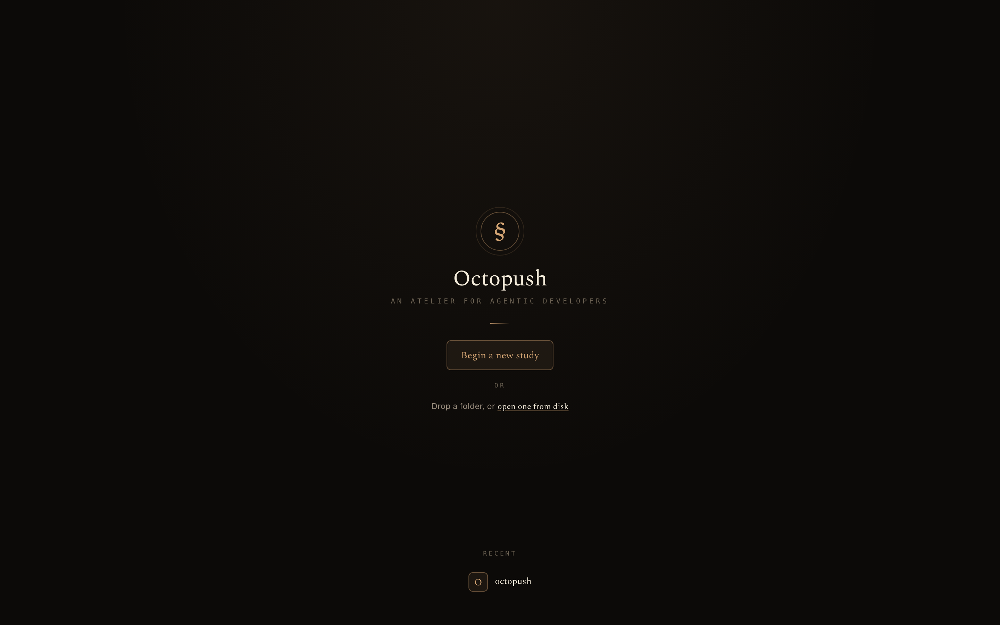
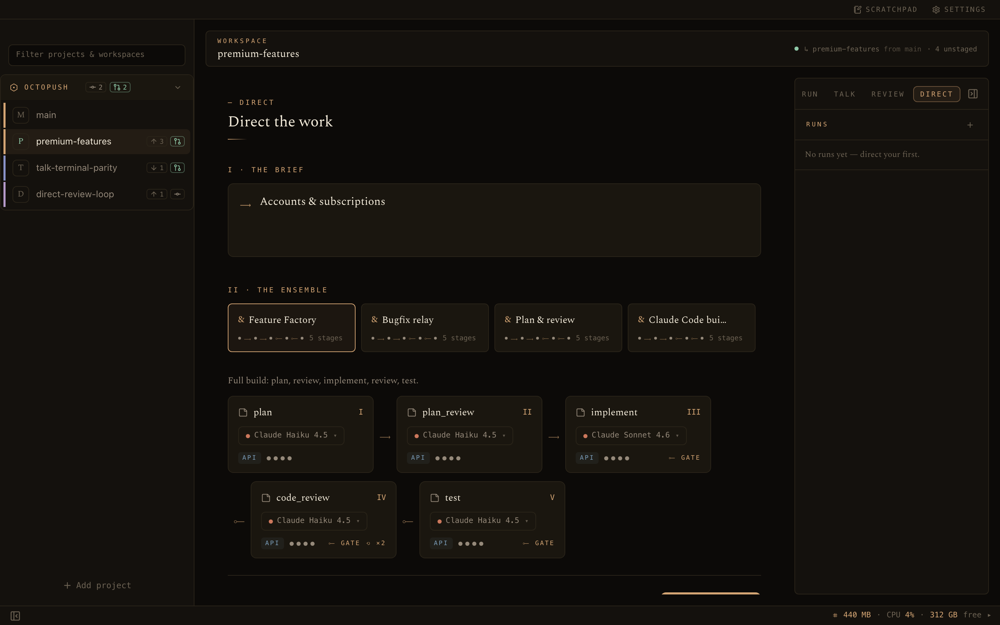
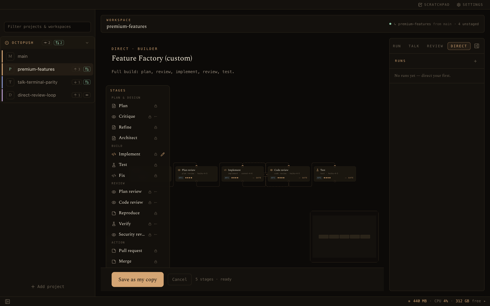
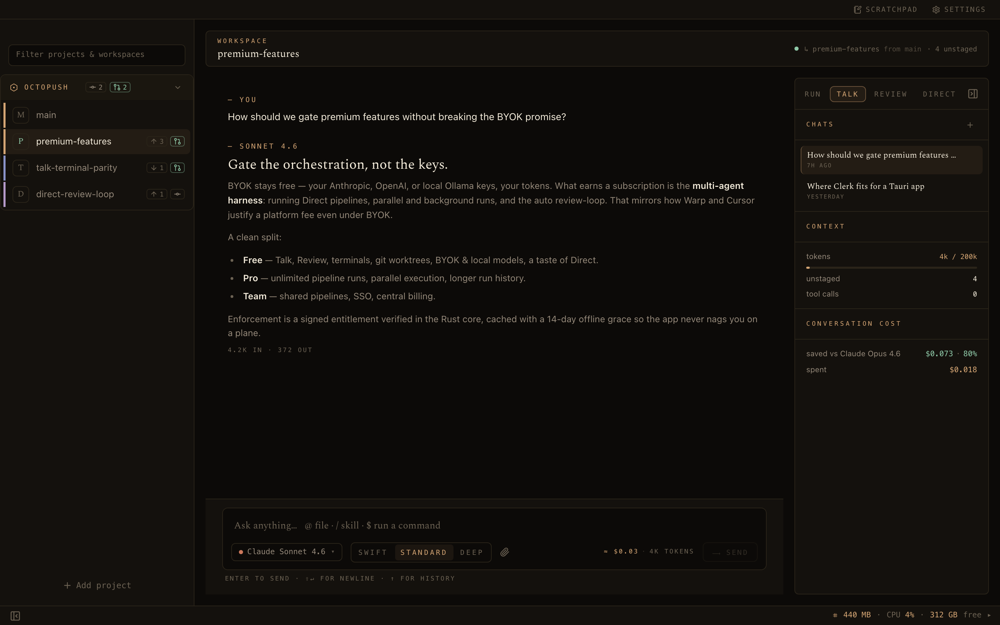
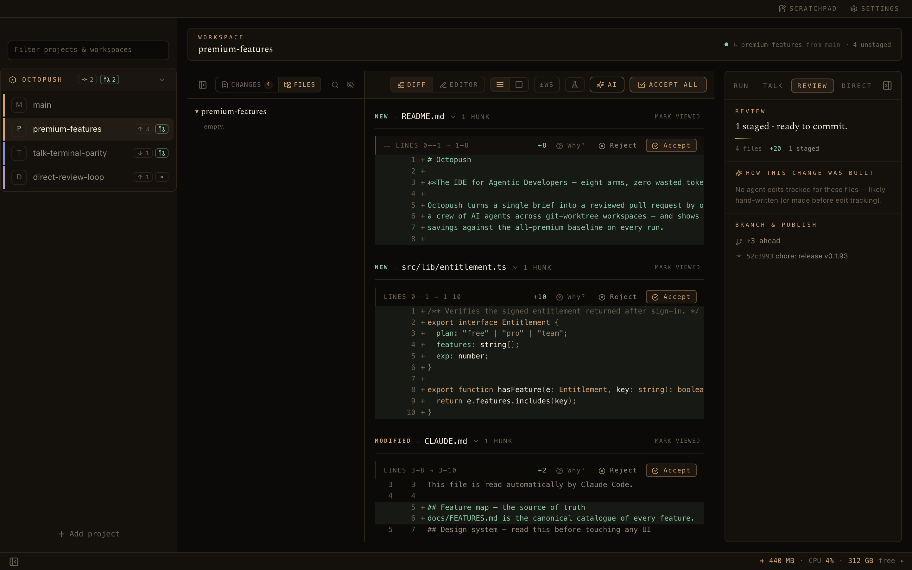

<div align="center">

# Octopush

### The IDE for Agentic Developers — eight arms, zero wasted tokens.

Octopush turns a single brief into a reviewed pull request by orchestrating a **crew of AI agents** across git‑worktree workspaces — and shows you the cost saved against the all‑premium baseline on every run.

<br/>



<br/>

[](https://github.com/octopush-sh/octopush/releases)


[**Download for macOS**](https://octopush.sh/download) · [**Docs**](https://octopush.sh/docs) · [**Pricing**](https://octopush.sh/#pricing)

</div>

---

## Why Octopush

Most AI coding tools bolt a chat box onto an editor. Octopush is built the other way around — the **agent workflow is the product**, and the editor, terminal, and git tooling are first‑class citizens that serve it.

- **🐙 Direct mode — multi‑agent orchestration.** Compose a pipeline of stages (plan → implement → review → test), each an AI agent with its own role, **model**, and **per‑stage reasoning effort**. Gate stages with human checkpoints, let reviewers **loop work back** until it passes, and recover gracefully from halts. Run it through the in‑app API or a headless **Claude Code** CLI.
- **💸 Cost‑conscious by construction.** Bring your own keys, route each stage to the right model, run **local models for free** — and watch the savings against an all‑premium baseline accumulate on every conversation and run. **The number nobody else shows you: what you saved.** A stage escalates to a stronger model **once, only after a proven failure** — you pay the expensive tier on a real failure, not by default.
- **💬 Talk mode — an agent that can actually do things.** A conversational agent that reads files, runs commands, and writes changes inside the workspace's worktree. Type `$ npm test` to run it with **zero tokens**; `@file` to attach context; `/skill` to load a `SKILL.md`.
- **🔍 Review mode — read every change like a senior engineer.** A continuous, word‑diffed, syntax‑highlighted diff with per‑hunk accept/reject, a real CodeMirror editor, an **AI review pass**, AI‑assisted conflict resolution, and a one‑click test runner.
- **🛡️ Sandboxed execution — and it's free.** With sandboxing on, a mission's agents run **write‑confined to the workspace** by the macOS seatbelt — your `~/.ssh`, `~/.aws`, other worktrees and system paths stay read‑only, enforced by the kernel, not asked of the agent. Review missions are read‑only by construction. **Security is never paywalled.**
- **🧭 The escape valve.** When a stage hits a genuine ambiguity, it **stops and asks you** — with a recommended default for each question, one click to accept — instead of guessing.
- **🌿 Workspaces are git worktrees.** Every task gets an isolated branch + working tree as a sibling folder — switch between five in‑flight features without stashing, and run an agent in each.
- **🛰️ Crews that work while you don't (Pro).** Detached runs survive quitting the app and post a native notification when the crew finishes or needs you; **Routines** fire scheduled crews on a Days × Times schedule, with an optional shell pre‑condition that skips a window when there's nothing to do.
- **🔒 Local‑first, zero telemetry.** Your code, keys, and history stay on your machine (`~/.octopush` + a local SQLite database). No analytics, no telemetry. Traffic only goes to the providers and integrations you configure.

> 🐙 Also shipped: **Mission Control** (the fleet cockpit, `⌘⇧M`), the **Logbook** (worked‑time · spend · savings per mission), **prompt genesis** (start from a prompt with no repo — "set a crew on it"), and **issue‑to‑PR** pipelines from a GitHub issue. See the site and `docs/FEATURES.md` for the full surface.

> 📖 For the **exhaustive** catalogue of every feature and how it's implemented, see **[`docs/FEATURES.md`](docs/FEATURES.md)** — the source of truth for what Octopush can do.

---

## A tour

### Direct — orchestrate a crew of agents

Describe the work, pick (or compose) a pipeline, tune the model on any stage, and launch. Octopush drives the run one stage at a time, pausing at the checkpoints you choose. The ledger shows what you spent versus what an all‑premium run would have cost.



Pipelines are authored on a **visual node graph**: drag roles from the palette, wire the flow, add a review **loop** that sends work back until it passes. **Seven built‑in pipelines** — Feature Factory, Bugfix relay, Plan & review, Ship it (issue‑to‑PR), Claude Code build, Greenfield (born into an empty repo), and Perf probe — are one click away, or fork them into your own from **15 built‑in roles**.



### Talk — a conversation that ships code

The agent works inside the workspace worktree with `read_file` / `write_file` / `run_command` / `list_files` tools, MCP tools from your configured servers, and any project skills. Every tool call is a card you can expand; every change is attributed back to the turn that made it. The Companion keeps a running tally of context, spend, and **savings versus the priciest model**.



### Review — accept the change, hunk by hunk

A continuous diff with sticky hunk rails, inline or side‑by‑side reading, word‑level highlighting, and keyboard‑driven triage (`a` accept, `x` reject, `]` next file). The Companion verdict tells you what's ready to commit and **how the change was built** — which agent turns shaped which files. Run an AI review pass or the test suite without leaving the screen.



---

## Bring your own keys

Octopush is **BYOK‑first**. Configure providers in Settings → Models; keys live only in `~/.octopush/settings.json` and never leave your machine except in requests to the provider you chose.

| Provider | Models (built‑in defaults) | Notes |
|---|---|---|
| **Anthropic** | Claude Opus 4.8 · Sonnet 4.6 · Haiku 4.5 | First‑class; powers the API substrate and Claude Code CLI stages |
| **OpenAI** | GPT‑4o · GPT‑4o‑mini | OpenAI‑compatible protocol |
| **DeepSeek** | deepseek‑chat · deepseek‑reasoner | Cheapest cloud option |
| **Ollama (local)** | llama3.3 · qwen2.5‑coder · deepseek‑r1 | **Free** — runs on your machine, no API key |

Add any other vendor or gateway by choosing one of two protocols (`anthropic` or `openai‑compatible`) and a base URL — there's no per‑vendor code. Pricing is editable per model and can be refreshed from the public LiteLLM catalogue, so the savings math stays honest.

---

## Architecture

```
┌──────────────────────────────────────────────────────────────┐
│  Octopush.app  (Tauri 2)                                       │
│                                                                │
│  Frontend  (src/)            Backend  (src-tauri/src/)         │
│  React 19 + TypeScript       Rust                              │
│  Tailwind v4 · Zustand       ~190 Tauri commands              │
│  CodeMirror · xterm.js       SQLite (db.rs) · providers/*      │
│  React Flow (builder)        orchestrator/*  · git_ops/*       │
│        │  invoke (ipc.ts)    chat_engine · issue_tracker/*     │
│        └───────────────►     token_engine · mcp/*             │
└───────────────┬──────────────────────────┬───────────────────┘
                │                           │
   ┌──────────────────┐  ┌──────────────────┐  ┌──────────────────┐
   │ octopush-pty-    │  │ octopush-mcp     │  │ octopush-run-    │
   │ server           │  │ read+author MCP  │  │ worker           │
   │ PTY daemon —     │  │ server — exposes │  │ detached-run     │
   │ terminals survive│  │ pipelines/runs   │  │ worker — crews   │
   │ app restarts     │  │ to Claude & CLIs │  │ survive app quit │
   └──────────────────┘  └──────────────────┘  └──────────────────┘
```

- **Frontend** — React 19 + TypeScript, Tailwind v4 design tokens, Zustand stores, all IPC funnelled through `src/lib/ipc.ts`. CodeMirror 6 editor, xterm.js terminals, React Flow pipeline builder, Recharts usage analytics.
- **Backend** — Rust. Tauri commands in `commands.rs`, SQLite via `db.rs`, the Direct‑mode orchestrator in `orchestrator/*`, a unified provider layer (`providers/*`), git via libgit2 + login‑shell shell‑outs, and Jira/GitHub/MCP integrations.
- **Three sidecar binaries** — `octopush-pty-server` owns all pseudo‑terminals so your shells (and live dev servers) survive app restarts and auto‑updates; `octopush-mcp` exposes Octopush's pipelines, projects, workspaces, and runs to external CLIs over MCP (read‑and‑author only — it never executes runs or spends tokens); `octopush-run-worker` drives detached Direct runs so a Pro user's crews keep going after the app quits.

---

## Getting started

**Prerequisites:** [Node.js](https://nodejs.org) 20+, [Rust](https://rustup.rs) (stable), and the [Tauri prerequisites](https://v2.tauri.app/start/prerequisites/) for your OS (on macOS: Xcode Command Line Tools).

```bash
# Install JS dependencies
npm install

# Run the full desktop app in dev mode (frontend + Rust backend)
npm run tauri:dev

# Frontend only (Vite dev server — no Rust backend)
npm run dev
```

| Command | What it does |
|---|---|
| `npm run tauri:dev` | Full Tauri app in dev mode |
| `npm run dev` | Vite dev server (frontend only) |
| `npm run build` | Typecheck + Vite production build |
| `npm run typecheck` | TypeScript check only |
| `npm test` | Vitest (frontend unit tests) |
| `cd src-tauri && cargo test` | Rust tests |
| `npm run tauri:build` | Build a distributable `.app` (bundles all three sidecars) |
| `npm run release -- <version>` | Cut a universal `.dmg` release (see [`docs/RELEASING.md`](docs/RELEASING.md)) |

On first launch Octopush creates `~/.octopush/` (settings, provider catalogue, theme) and a SQLite database under `~/Library/Application Support/octopush/`.

---

## Project layout

```
src/                      React frontend
  components/             UI — modes, rail, companion, builder, review, settings…
  stores/                 Zustand state (chat, workspaces, runs, tokens, …)
  lib/ipc.ts              the single typed bridge to Rust
src-tauri/src/            Rust backend
  commands.rs             every Tauri command (registered in lib.rs)
  orchestrator/           Direct-mode multi-agent engine
  providers/              Anthropic + OpenAI-compatible adapters
  git_ops.rs · github.rs  git (libgit2 + shell-outs) and PR integration
  issue_tracker/          Jira
  bin/octopush-pty-server PTY daemon (terminals survive restarts)
  bin/octopush-mcp        MCP server exposing Octopush to other CLIs
  bin/octopush-run-worker detached-run worker (Pro crews survive app quit)
docs/
  FEATURES.md             ← exhaustive feature map (source of truth)
  design-system.md        Atelier in Onyx & Brass — tokens & patterns
  premium/                Free vs Pro entitlement model & design notes
```

---

## Design

Octopush has a deliberate visual identity — **Atelier in Onyx & Brass**. Onyx surfaces, a single surgical brass accent, three type voices (an upright serif for moments, a system sans for body, JetBrains Mono for meta), and calm, token‑driven motion. It's meant to feel like *itself*, not like a generic AI tool. See **[`docs/design-system.md`](docs/design-system.md)**.

---

## Free & Pro

Octopush is **BYOK‑first**: you bring your own keys and pay your provider directly. The **Free** tier is a real, complete tool — Talk, Run and Review are unlimited, and **security is never paywalled**. **Pro** ($20/mo, via Clerk sign‑in + Dodo Payments) unlocks the orchestration‑at‑scale features. Your keys and local data never leave your device on either tier. Full breakdown at **[octopush.sh/#pricing](https://octopush.sh/#pricing)**.

| | **Free** — $0 | **Pro** — $20/mo |
|---|---|---|
| Talk · Run · Review | ✅ unlimited | ✅ unlimited |
| Bring your own keys · budgets · cost meters | ✅ | ✅ |
| Sandboxed execution (macOS seatbelt) | ✅ | ✅ |
| Direct pipeline runs | 25 / month, one at a time | ✅ unlimited |
| Parallel & background runs | — | ✅ |
| Detached runs (crews survive app quit) | — | ✅ |
| Routines (scheduled crews) | — | ✅ |
| Cross‑machine run History sync | — | ✅ |
| Library sync (pipelines & roles) | — | ✅ |
| Logbook | per‑mission | + cross‑mission Room |

Entitlements are enforced against the signed‑in plan; same‑workspace concurrency stays blocked for everyone (git‑worktree safety). Design notes live in [`docs/premium/`](docs/premium/).

---

## Documentation

- **[`docs/FEATURES.md`](docs/FEATURES.md)** — every feature, and how it works.
- **[`docs/design-system.md`](docs/design-system.md)** — the design system cheatsheet.
- **[`docs/octopush-mcp.md`](docs/octopush-mcp.md)** — the bundled MCP server.
- **[`docs/RELEASING.md`](docs/RELEASING.md)** — how a release is cut (universal `.dmg`, signing, updater).
- **[`CLAUDE.md`](CLAUDE.md)** — guidelines for AI assistants working in this repo.
- **[`docs/superpowers/`](docs/superpowers/)** — design specs and implementation plans.

---

<div align="center">

**Octopush** · an atelier for agentic developers

</div>
